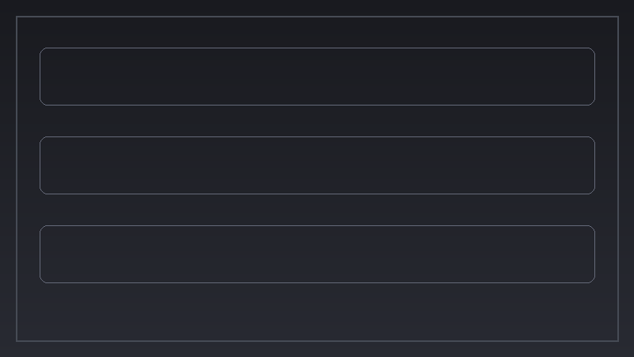
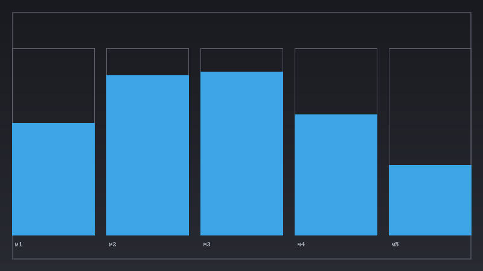

[]()
[](LICENSE)
[]()
[]()

# Agents.md — Codegen Workflow for *PhaelusJam*

## Getting Started
```bash
git clone https://github.com/YOURNAME/phaelus-jam.git
cd phaelus-jam
python -m venv .venv && source .venv/bin/activate   # Windows: .venv\Scriptsctivate
pip install -e .
uvicorn server.main:app --reload
```

## Contributing
- Use small PRs; docstrings & typing.
- `agents/agent_cli.py` composes prompts; tests under `tests/`.
- Share preset packs via `server/presets/*.json`.

## Visual Mockups
_showcase.png)






