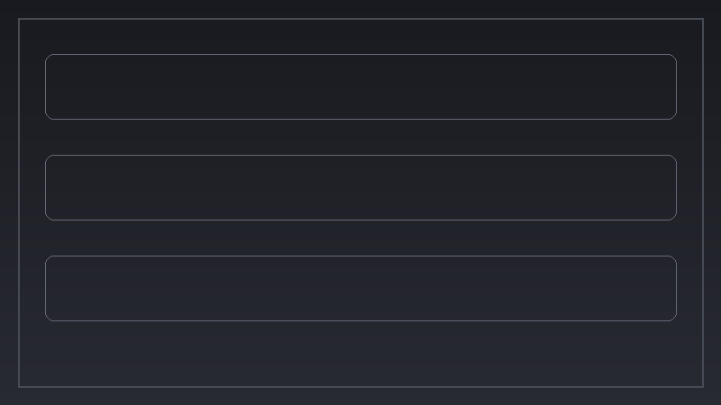
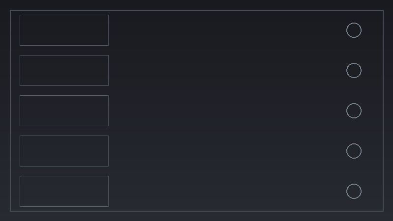
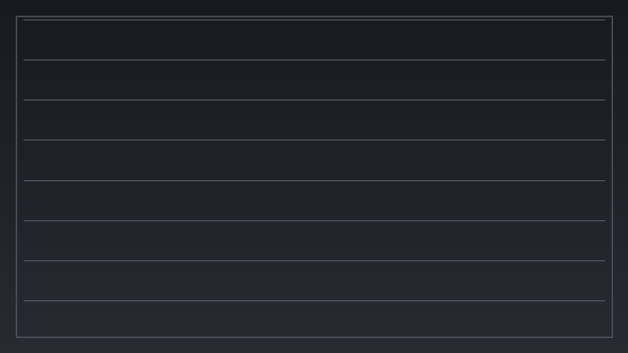
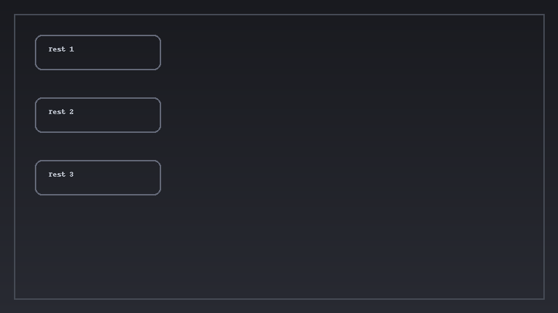

[]()
[](LICENSE)
[]()
[]()

# PhaelusJam
**An AI-powered real-time composer & accompanist**  
by **LogicMUSE**

## Interface (DAW-style)
- **Top bar**: Title *Phaelus Jam by LogicMUSE*, AI On/Off, LED strip (WS, IN, OUT, ENG, LLM)
- **Tabs**: Front, Configuration, Monitoring, Advanced Logging, Testing

## Run (Web UI)
```bash
python -m venv .venv && source .venv/bin/activate  # Windows: .venv\Scriptsctivate
pip install -r requirements.txt
uvicorn server.main:app --reload
# open http://127.0.0.1:8000
```

## 🖼 Mockups
### Current functional look
_showcase.png)

### Target polished design (Cubase-style plugin)


### Tab Previews
- **Front Panel**  
  

- **Configuration Panel**  
  

- **Monitoring Panel**  
  

- **Advanced Logging Panel**  
  

- **Testing Panel**  
  

## CI
This repo includes GitHub Actions CI (ruff, black, pytest). Update the build badge after pushing.

## Developer workflow
### Pre-commit
```bash
pip install pre-commit
pre-commit install
```

### Releasing (optional)
Add PYPI_API_TOKEN secret. Tag and push `v0.1.0` to release.
